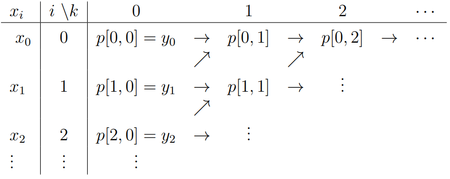
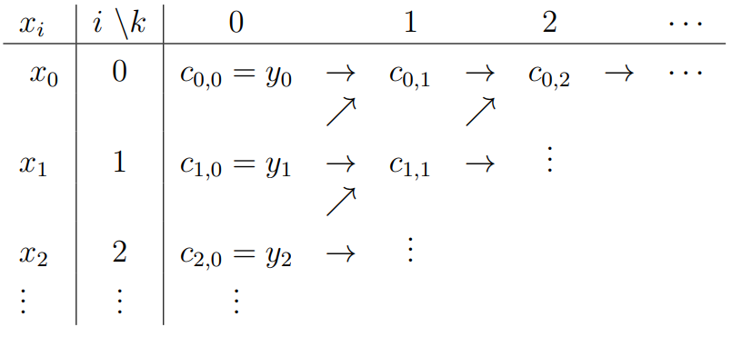
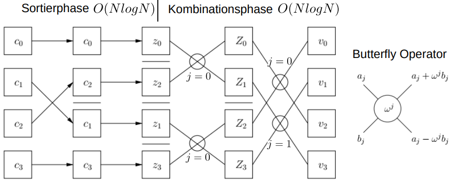

## NumProg Summary
$\qquad\qquad\qquad\qquad\qquad \text{\it by jws}$

#### Overview (and Todos)

1) Floating Points, Rounding, Condition & Stability, Cancellation

2) Interpolation:
    - with polynomials
    - with splines
    - with trigonometric functions / DFT

3) Numerical Quadrature (Integrals)
    - rectangle rule
    - trapezoidal rule
    - Kepler's rule
    - ...

4) Solving Linear Systems Directly
    - Gaussian Elimination
    - LU factorization
    - Cholesky factorization
    - Pivot search

5) Ordinary Differential Equations (ODE)
    - Separation of variables
    - One-step methods:
        - Euler method
        - Heun method
        - Runge and Kutta method
    - Local & Global discretization error
    - Multistep methods:
        - Adams-Bashforth method
    - Stiffness
    - Implicit methods:
        - Implicit Euler method

6) Iterative Roots and Optima
    - Relaxation methods
        - ...
    - Minimization methods
        - ...
    - Non-linear methods
        - ...
    - Multigrid

7) Symmetric Eigenvalue Problem

8) Hardware-Aware Computing
    - Space-filling curves
    - Matrix multiplication

**TODO:**
- saturday 1-4
- sunday 5-8
- monday altklausuren & coding
- tuesday party

#### 0. Error Analysis:

Exact value $x$ gets perturbed with error and becomes perturbed value $\tilde x$:
**Absolute error** $\delta x := \tilde x - x \implies \tilde x = x + \delta x$
**Relative error** $\varepsilon := \frac{\tilde x - x}{x} = \frac{\delta x}{x} \implies \tilde x = x(1 + \varepsilon)$
similarly, *absolute output error* = $f(\tilde x) - f(x)$ and *relative output error* = $\frac{f(\tilde x) - f(x)} {f(x)}$

Two equivalent ways to view perturbation of operation $a \dot + b$:
**Forward analysis**: exact input $a, b \rarr$ exact result $a + b \rightsquigarrow$ perturbed result $(a+b)(1+\varepsilon)$
**Backward analysis**: exact input $a, b \rightsquigarrow$ perturbed input $a(1+\varepsilon), b(1+\varepsilon) \rarr$ "exact" result $a(1+\varepsilon) + b(1+\varepsilon)$
$\qquad\qquad\qquad a \dot \cdot b = \underbrace{(a \cdot b) (1 + \varepsilon)}_\text{forward} = \underbrace{(a \sqrt{1+\varepsilon}) \cdot (b \sqrt{1+\varepsilon})}_\text{backward}$

**Condition**: sensitivity of output according to input perturbation (>1: amplification of error) inherent to the *problem*, not the used algorithm
$\text{abs cond} := \frac{\text{abs output error}}{\text{abs input error}}$, $\text{rel cond} := \frac{\text{rel output error}}{\text{rel input error}}$
Approximation with derivative: $cond(f, x) = |\frac{x \cdot f'(x)}{f(x)}|$
Chaining of compound problems: $cond(f(x)) := \frac{\partial f(x)}{\partial x}$

**Stability**: an algorithm is **stable**, if all perturbed inputs produce *acceptable* results:
An approximation $\tilde y(x)$ is **acceptable** if it's the exact solution to a perturbed input: $\tilde y(x) = p(\tilde x)$ (thus if the problem is *ill-conditioned*, $\delta y$ can be large and still be *acceptable*)
Stability analysis with **Epsilontik**: ...

**Cancellation**: when subtracting two very similar numbers ($1000 - 999$), even very small relative input error $\pm \frac{1}{1000}$ can lead to high relative output error ($= 2$) which causes the relative condition number to explode ($2000$), even worse for *complete cancellation* (exact result = 0) $\implies cond = \infin$!

#### 1. Floating Point Numbers

Discretization of $\R$, without the disadvantages of fixed point *(fixed range, overflow, too little precision at small numbers and wasted precision at big numbers, ...)*

Normalized $t$-digit floating point to basis $B$ (**machine number**):

$\mathbb{F}_{B,t,\alpha,\beta} = \{ M \cdot B^E \mid M=0 \lor \underbrace{B^{t-1} \leq |M| < B^t}_{\Rightarrow\ t \text{ digits, no leading 0}},\ \underbrace{\alpha \leq E \leq \beta}_{\text{range for E}}, \text{ with } M, E \in \Z  \}$

The **mantissa** $M$ and **exponent** $E$ are saved as integers, the basis $B$ and digits $t$ are ususally implicit.

The **absolute distance** between two neighboring floats is not constant:
    $\qquad |98 \cdot 10^0 - 99 \cdot 10^0| = 10^0$
    $\qquad |98 \cdot 10^1 - 99 \cdot 10^1| = 10^1$
The bigger the absolute value gets, the less precision it has (*logarithmic scale!*)

Max relative distance = **resolution** $\varrho := B^{1-t} \geq \frac{1}{|M|} = \frac{(|M|+1) \cdot B^E - |M| \cdot B^E}{|M| \cdot B^E}$
Min positive float = $\sigma := B^{t-1} \cdot B^\alpha$
Max float = $\lambda := (B^t - 1) \cdot B^\beta$

**Rounding** function $rd(x)$ maps every $x \in \R$ to a $f \in \mathbb{F}$
  - they should be surjective, idempotent and monotone
  - if $x \in \mathbb{F}$, then $rd(x) = x$
  - if  $x \in \R \setminus \mathbb{F}$, then every $x := (M + \delta) \cdot B^E,\text{ with } \delta \in (0; 1)$ has a neighbor to left/right:
        $\quad f_l(x) := max\{ f \in \mathbb{F} \mid f \leq x \} = M \cdot B^E$
        $\quad f_r(x) := min\{ f \in \mathbb{F} \mid f \geq x \} = (M+1) \cdot B^E$
  - *rounding down*: $rd_-(x) := f_l(x)$, *rounding up:* $rd_+(x) := f_r(x)$
  - *chop off* (= towards zero): $rd_0(x) := \begin{cases} f_l(x) & \text{if } x \geq 0 \\ f_r(x) & \text{if } x \leq 0 \end{cases}$
  - *correct rounding* (= towards closest): $rd_*(x) := \begin{cases} f_l(x) & \text{if } x < m \\ f_r(x) & \text{if } x > m \end{cases} \text{ with } m := \frac{f_l(x)+f_r(x)}{2}$
  - if x is exactly in the middle, choose what to do!
  - **absolute rounding error**: $rd(x) - x$
  - **relative rounding error**: $\varepsilon := \frac{rd(x)-x}{x} \implies rd(x) = x \cdot (1+\varepsilon)$
  - **machine accuracy** $\bar \varepsilon \geq |\varepsilon|$: directed rounding: $\bar \varepsilon := \varrho$, correct rounding: $\bar \varepsilon := \varrho / 2$
  - the *weak hypothesis* (see Lec.1 P.27) only allows for backward analysis, the *strong* allows for both

A floating point arithmetic $\dot *$ is ideal if it's the rounded *exact* result: $a \dot * b= rd(a * b) = (a * b) \cdot (1 + \varepsilon(a, b))$
Most floating point operators are **not associative** anymore!

##### IEEE-Standard Floats:

- 32-bit:
  - 1 bit: sign ($0 = +, 1 = -$)
  - 8 bits: $E + 127 \implies E = 8bits - 127$, -127 and +128 reserved
  - 23 bits: $|M| = 1.[23bits]$ (normalized with leading 1)
  - rounding: correct rounding + for exact middle (0.1): round towards even number

- 64-bit;
    ...

#### 2. Interpolation

Given $n$ **support points** $(x_i, y_i)$ of function $f(x)$, build an approximant $p(x)$ that goes through them: $\forall i: p(x_i) = y_i$
**mesh width** $h_i := x_{i+1} - x_i$

**Lagrange interpolation**: Only support points are given
**Hermite interpolation**: Each support points additionally have required derivative $y'_i$

**Interpolation using polynoms:**
- Simple approach: Find coefficients of general term $p(x) := \sum_{i=0}^n a_i \cdot x^i$ by solving the system of equations for each support point $(x_i, y_i)$
- **Lagrange polynomial**: $L_k(x) := \prod_{i:i \neq k} \frac{x-x_i}{x_k-x_i}$ with property that it equals 0 for all nodes except $x_k$, and becomes 1 at node $x_k$
Therefore $p(x) := \sum_{i=0}^n y_i \cdot L_i(x)$ is a valid polynomial interpolant.
- **Scheme of Aitken and Neville**: Instead of explicitly finding the term $p(x)$, calculate the interpolated value for a concrete $x$
  - Define auxiliary polynomials $p_{i,k}(x)$ which are polynomials of degree $k$ and interpolate the support points in $[i; i+k]$ (thus base case $\forall i: p_{i,0}(x) = y_i$)
  - Recursive formula: $p_{i,k}(x) = \frac{x_{i+k} - x}{x_{i+k} - x_i} \cdot p_{i, k-1}(x) + \frac{x - x_i}{x_{i+k} - x_i} \cdot p_{i+1, k-1}(x)$
  
  - Then $p(x) := p_{0,n}(x)$ (if instead recursive formula is evaluated, the full term $p(x)$ can be determined)

- **Newton's Interpolation Formula**: Another recursive formula, but *incremental*, i.e. when another node $x_{n+1}$ is added, only *one new summand has to be added*!
  - The **divided difference** of $p_{i,k}$ is the coefficient of the highest degree term $x^k$: $[x_i,...,x_{i+k}]f =: c_{i, k}$ (thus base case $\forall i: c_{i,0} = y_i$)
  - Recursive formula: $c_{i,k} = \frac{c_{i+1,k-1} - c_{i,k-1}}{x_{i+k} - x_i}$
  
  - Then $p(x) := c_{0,0} + c_{0,1} \cdot (x-x_0) + ... + c_{0,n} \cdot \prod_{i=0}^{n-1} (x-x_i)$

- **Error of polynomial interpolants**: For a concrete intermediate point $\bar x$, its error $|f(\bar x) - p(\bar x)|$ is in $O(h^{n+1})$ for *equidistant mesh width* $h$:
  $\Rightarrow$ lower $h$ and higher $n$ *should* decrease error in theory (but due to Runge effect, not in practice!)
  - Equidistant nodes not optimal! (*Chebychev nodes* to add more nodes at the edges is optimal)

- **Condition of polynomial interpolants**: Sensitivity of error in $p(x)$ regarding error in $y_i$
  - derivative of $y$ regarding $y_i$ is $L_i(x)$, but small errors in central supporting values are dramatically increased at the borders of the interpolation interval!
  - for large n (7+ or 8+), extremely ill-conditioned for equidistant nodes

**Interpolation using Polynomial Splines:** Glue together pieces of polynomials of lower degree to avoid expensive computation and the Runge effect
- Spline $s: [a; b] \rarr \R$ of order $m$ / degree $m-1$:
- $s(x) = p_i(x)$ on $[x_i; x_{i+1}]$, $n$ pieces of polynomials between each knots ($n+1$ knots)
- Locally: Between two knots, polynomial of degree $m-1$ ($p_i \in \mathbb{P}_{m-1}$)
- Globally: $s$ is $m-2$ times continuously differentiable ($s \in C^{m-2}([a;b])$)
  $m=1$: step function (piecewise continuous, not really a spline)
  $m=2$: linear interpolation (knots are connected, not really spline either)
  $m=3$: quadratic spline (knots have no sharp bends)
  $m=4$: cubic spline (continuous 1st & 2nd derivatives)
- $n+m-1$ degrees of freedom (of which $n+1$ knot contraints are given)

**Cubic Splines** ($m=4$): Each piece is a cubic polynomial with parameters $y_i$, $y_{i+1}$, $y_i'$, $y_{i+1}'$:
$s(x) := p_i(t)$ where $t$ linearly connects from $(x_i; 0)$ to $(x_{i+1}; 1)$: $t := \frac{x-x_i}{x_{i+1}-x_i}$
then $p_i(t) := y_i \cdot \alpha_1(t) + y_{i+1} \cdot \alpha_2(t) + (x_{i+1} - x_i) \cdot (y_i' \cdot \alpha_3(t) + y_{i+1}' \cdot \alpha_4(t))$ (see Lec.2 P.31 for $\alpha_i$ def.)
<!--$\alpha_1(t) := 1 - 3t^2 + 2t^3;\ \alpha_2(t) := 3t^2 - 2t^3;\ \alpha_3(t) := t - 2t^2 + t^3;\ \alpha_4(t) := -t^2 + t^3$-->
To determine the $y_i'$s such that the 2nd derivatives at the knots are continuous, solve $p_{i-1}''(1) = p_i''(0)$ for all $y_i$s (tridiagonal system of linear equations of dim $n-1$)
The remaining 2 degrees of freedom $y_0', y_n'$ are boundary conditions, either given directly, set by given 2nd derivatives, or such that it's periodic ($y_0' = y_n'$ and $s''(x_0) = s''(x_n)$)

**Cost**: Tridiagonal system of equations can be solved in $O(n)$ as opposed to $O(n^3)$ for a full system, or the $O(n^2)$ for Aitken and Neville / Newton

**Error**: Since we're using cubic polynomials, $|f(x)-s(x)| = O(h^4)$

**Trigonometric Interpolation**: Given $n$ nodes on the unit circle $z_j := e^{2\pi i j / n}$ (equally spaced on the circle edge) and their corresponding values $v_j$, find the interpolant $p(z)$ where $z := e^{2\pi i t}, t \in [0; 1]$ such that $\forall j: p(z_j) = v_j$
General representation as a linear combination of exponential functions:
$p(z) := \sum_{k=0}^{n-1} c_k z^k = \sum_{k=0}^{n-1} c_k e^{2 \pi i k t}$ (can be separated into $cos$ and $sin$)
Find the coefficients $c_k \implies$ **Discrete Fourier Transform**: 
  - for $\omega := e^{2 \pi i / n}, M = (\omega^{jk})$, solve $\vec v = IDFT(\vec c) := M \cdot \vec c\ {} $ or $\ \vec c = DFT(\vec v) := \frac{1}{n} \cdot \overline M \cdot \vec v$, which takes $O(n^2)$
  - the **Fast Fourier Transform** can calculate $v = IDFT(c)$ in $O(n\ log\ n)$ through recursion, halving $n = 2m$, $j \in [0; m-1]$:
    $v_j = IDFT(c_0, c_2, ...) + \omega^j \cdot IDFT(c_1, c_3, ...)$
    $v_{j+m} = \underbrace{IDFT(c_0, c_2, ...)}_{\text{even coefficients}} - \omega^j \cdot \underbrace{IDFT(c_1, c_3, ...)}_{\text{odd coefficients}}$
  - Easier to visualize:
  

  **Cosine Transform?**: ...

#### 3. Numerical Quadrature

Given function $f: [a; b] \rarr \R$, calculate definite integral $I(f) := \int_a^b f(x) dx$ using approximant **rules of quadratures**, which are weighted sums of samples $(x_i, y_i)$:
$I(f) \approx Q(f) := \sum_{i=0}^n g_i \cdot y_i$ with weights $g_i$ (thus: find appropriate weights!)
We can use polynomial interpolation $p(x)$ of $f(x)$ to find the weights:
$Q(f) := \int_a^b p(x)dx = \int_a^b \sum y_i L_i(x) dx \implies g_i := \int_a^b L_i(x)dx$
$\qquad$($L_i$ *only depends on $x_i$; weights can be pre-calculated!*)
$\qquad$(since $\sum_i L_i(x) = 1 \implies \sum_i g_i = b - a$)

**Condition of quadrature**: For input error $|\delta y_i| \leq \varepsilon$, its output error $\delta Q(f)$ has the upper bound $|\delta Q(f)| \leq \varepsilon \cdot \sum_i |g_i|$, which depends on the weights:
$\forall i: g_i \geq 0 \implies \sum_i |g_i| = b - a \implies$ **well-conditioned $O(\varepsilon)$!**
$\exists i: g_i < 0 \implies \sum_i |g_i| > b- a \implies$ **ill-conditioned**! (occurs at big $n$)

**Simple rules of quadrature** calculate the result of the entire $[a;b]$ at once ($H := b-a$):
  - The **rectangle rule** $Q_R(f) := H \cdot f(\frac{a+b}{2}) = H \cdot y_0$ takes one sample point in the middle $x_0 := (a+b)/2$ (exact integral of constant interpolant)
  Its *remainder* $R_R(f) = -H^3 \cdot \frac{f^{(2)}(\xi)}{24}$ for intermediate point $\xi \in (a; b)$; thus $Q_R$ is exact for $f \in \mathbb{P}_0$ or $\mathbb{P}_1$ (**order** 3; **degree of accuracy** = 1)
  - The **trapezoidal rule** $Q_T(f) := H \cdot \frac{f(a) + f(b)}{2} = H \cdot \frac{y_0 +y_1}{2}$ takes two sample points $x_0 := a$ and $x_1 := b$ (exact integral of linear interpolant)
  Its *remainder* $R_T(f) = H^3 \cdot \frac{f^{(2)}(\xi)}{12}$ again exact for $f \in \mathbb{P}_0$ or $\mathbb{P}_1$ (**order** 3; **accuracy** 1)
  - The **Kepler's rule** $Q_F(f) := H \cdot \frac{f(a) + 4 f((a+b)/2) + f(b)}{6} = H \cdot \frac{y_0 + 4y_1 + y_2}{6}$ takes three sample points $x_0 := a$, $x_1 := (a+b)/2$, $x_2 := b$ (exact integral of quadratic interpolant)
  *remainder* $R_F(f) = H^5 \cdot \frac{f^{(4)}(\xi)}{2880}$; thus **order** 5 and **accuracy** 3
  - The **Newton-Cotes formula** generalizes this increasing sample points and order: $Q_{NC}(f) := I(p_n)$ where $p_n$ polynomial interpolant of degree $n$ to the $n+1$ *equidistant nodes* $x_0 := a, ..., x_i := a + H \cdot i/n, ..., x_n := b$
  Thus with growing $n$, the order and accuracy increases. But for $n = 8$ and $n \geq 10$, *negative weights* occur; **very ill-conditioned**!
  - The **Clenshaw-Curtis rules** uses non-uniformly distributed nodes (*Chebychev nodes*: x component of uniformly subdivided angles on a semicircle) to *completely avoid negative weights*: $x_i := a + H \cdot (1- cos(i \pi / n)) / 2$
  Thus can be used for large $n$ without being ill-conditioned (but composite rules are more practical)

**Composite rules of quadrature** split the integration domain $[a;b]$ into $n$ subdomains of length $h := (b-a) / n$, applies simple rules and sums up, just like splines!
  - The **trapezoidal sum** applies the trapezoidal rule between each nodes: $Q_{TS}(f; h) := h \cdot (\frac{y_0}{2} + y_1 + ... + \frac{y_n}{2})$ (therefore weights $g_0 := h/2 =: g_n, \text{ otherwise } g_i := h$), integral of linear splines!)
  Its *remainder* $R_{TS}(f; h) = h^2 \cdot H \cdot \frac{f^{(2)}(\xi)}{12}$ (**order** *decreased by 1* to 2; **accuracy** still 1), $n$ can grow without condition problem
  - The **Simpson sum** applies the Kepler's rule to each node pairs (without overlap): $Q_{SS}(f;h) := \frac{h}{3} \cdot (y_0 + 4y_1 + 2y_2+ 4y_3 + ... + y_n)$ (alternates between 4 $\lrarr$ 2 and 1 on each ends)
  *remainder* $R_{SS}(f;h) = h^4 \cdot H \cdot \frac{f^{(4)}(\xi)}{180}$ (**order** *decreased by 1* to 4; **accuracy** still 3), $n$ can also grow without condition problem

**Extrapolation**: Express the quadrature as exact value + error (**Euler-Maclaurin sum formula**, if $f \in C^{2m}$):
$Q_{TS}(f; h) = \underbrace{I(f)}_\text{exact} + \underbrace{\tau_1 h^2 + ... + \tau_{m-1} h^{2m-2} + \tau_m(h) \cdot h^{2m}}_\text{error} =: T(h)$
  - You could linearly combine different $h_i$ values to reduce the error (first eliminate the unknown factor $\tau_1$, then $\tau_2$, etc...)
  - Alternative perception of the **Romberg quadrature**: $h \to 0 
  \implies T(h) \to I(f)$ exact integral, therefore interpolate $T(h)$ with $p \in \mathbb{P}_{m-1}$ in the nodes $(h_i^2, T(h_i)), i \in [1;m]$ and use $p(0)$ as approximation of $I(f)$ (calculate $p(0)$ with *Neville's scheme*)
  - The **error** $|I(f) - p(0)|$ is in $O(h_1^2 \cdot h_2^2 \cdot ... \cdot h_m^2)$, which is *significantly* better than the trapezoidal rule (but $f$ must be $2m$-times continuously differentiable!)
