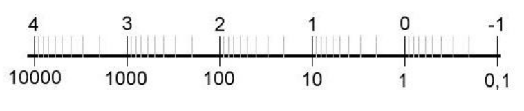

## NumProg Summary
$\qquad\qquad\qquad\qquad\qquad \text{\it by jws}$

#### Overview (and Todos)

1) Floating Points, Rounding, Condition & Stability, Cancellation

2) Interpolation:
    - with polynomials
    - with splines
    - with trigonometric functions / DFT

3) Numerical Quadrature (Integrals)
    - rectangle rule
    - trapezoidal rule
    - Kepler's rule
    - ...

4) Solving Linear Systems Directly
    - Gaussian Elimination
    - LU factorization
    - Cholesky factorization
    - Pivot search

5) Ordinary Differential Equations (ODE)
    - Separation of variables
    - One-step methods:
        - Euler method
        - Heun method
        - Runge and Kutta method
    - Local & Global discretization error
    - Multistep methods:
        - Adams-Bashforth method
    - Stiffness
    - Implicit methods:
        - Implicit Euler method

6) Iterative Roots and Optima
    - Relaxation methods
        - ...
    - Minimization methods
        - ...
    - Non-linear methods
        - ...
    - Multigrid

7) Symmetric Eigenvalue Problem

8) Hardware-Aware Computing
    - Space-filling curves
    - Matrix multiplication

**TODO:**
- saturday 1-4
- sunday 5-8
- monday altklausuren & coding
- tuesday party

#### 0. Error Analysis:

Exact value $x$ gets perturbed with error and becomes perturbed value $\tilde x$:
**Absolute error** $\delta x := \tilde x - x \implies \tilde x = x + \delta x$
**Relative error** $\varepsilon := \frac{\tilde x - x}{x} = \frac{\delta x}{x} \implies \tilde x = x(1 + \varepsilon)$
similarly, *absolute output error* = $f(\tilde x) - f(x)$ and *relative output error* = $\frac{f(\tilde x) - f(x)} {f(x)}$

Two equivalent ways to view perturbation of operation $a \dot + b$:
**Forward analysis**: exact input $a, b \rarr$ exact result $a + b \rightsquigarrow$ perturbed result $(a+b)(1+\varepsilon)$
**Backward analysis**: exact input $a, b \rightsquigarrow$ perturbed input $a(1+\varepsilon), b(1+\varepsilon) \rarr$ "exact" result $a(1+\varepsilon) + b(1+\varepsilon)$
$\qquad\qquad\qquad a \dot \cdot b = \underbrace{(a \cdot b) (1 + \varepsilon)}_\text{forward} = \underbrace{(a \sqrt{1+\varepsilon}) \cdot (b \sqrt{1+\varepsilon})}_\text{backward}$

**Condition**: sensitivity of output according to input perturbation (>1: amplification of error) inherent to the *problem*, not the used algorithm
$\text{abs cond} := \frac{\text{abs output error}}{\text{abs input error}}$, $\text{rel cond} := \frac{\text{rel output error}}{\text{rel input error}}$
Approximation with derivative: $cond(f, x) = |\frac{x \cdot f'(x)}{f(x)}|$
Chaining of compound problems: $cond(f(x)) := \frac{\partial f(x)}{\partial x}$

**Stability**: an algorithm is **stable**, if all perturbed inputs produce *acceptable* results:
An approximation $\tilde y(x)$ is **acceptable** if it's the exact solution to a perturbed input: $\tilde y(x) = p(\tilde x)$ (thus if the problem is *ill-conditioned*, $\delta y$ can be large and still be *acceptable*)
Stability analysis with **Epsilontik**: ...

**Cancellation**: when subtracting two very similar numbers ($1000 - 999$), even very small relative input error $\pm \frac{1}{1000}$ can lead to high relative output error ($= 2$) which causes the relative condition number to explode ($2000$), even worse for *complete cancellation* (exact result = 0) $\implies cond = \infin$!

#### 1. Floating Point Numbers

Discretization of $\R$, without the disadvantages of fixed point *(fixed range, overflow, too little precision at small numbers and wasted precision at big numbers, ...)*

Normalized $t$-digit floating point to basis $B$ (**machine number**):

$\mathbb{F}_{B,t,\alpha,\beta} = \{ M \cdot B^E \mid M=0 \lor \underbrace{B^{t-1} \leq |M| < B^t}_{\Rightarrow\ t \text{ digits, no leading 0}},\ \underbrace{\alpha \leq E \leq \beta}_{\text{range for E}}, \text{ with } M, E \in \Z  \}$

The **mantissa** $M$ and **exponent** $E$ are saved as integers, the basis $B$ and digits $t$ are ususally implicit.

The **absolute distance** between two neighboring floats is not constant:
    $\qquad |98 \cdot 10^0 - 99 \cdot 10^0| = 10^0$
    $\qquad |98 \cdot 10^1 - 99 \cdot 10^1| = 10^1$
The bigger the absolute value gets, the less precision it has (*logarithmic scale!*)

Max relative distance = **resolution** $\varrho := B^{1-t} \geq \frac{1}{|M|} = \frac{(|M|+1) \cdot B^E - |M| \cdot B^E}{|M| \cdot B^E}$
Min positive float = $\sigma := B^{t-1} \cdot B^\alpha$
Max float = $\lambda := (B^t - 1) \cdot B^\beta$

**Rounding** function $rd(x)$ maps every $x \in \R$ to a $f \in \mathbb{F}$
  - they should be surjective, idempotent and monotone
  - if $x \in \mathbb{F}$, then $rd(x) = x$
  - if  $x \in \R \setminus \mathbb{F}$, then every $x := (M + \delta) \cdot B^E,\text{ with } \delta \in (0; 1)$ has a neighbor to left/right:
        $\quad f_l(x) := max\{ f \in \mathbb{F} \mid f \leq x \} = M \cdot B^E$
        $\quad f_r(x) := min\{ f \in \mathbb{F} \mid f \geq x \} = (M+1) \cdot B^E$
  - *rounding down*: $rd_-(x) := f_l(x)$, *rounding up:* $rd_+(x) := f_r(x)$
  - *chop off* (= towards zero): $rd_0(x) := \begin{cases} f_l(x) & \text{if } x \geq 0 \\ f_r(x) & \text{if } x \leq 0 \end{cases}$
  - *correct rounding* (= towards closest): $rd_*(x) := \begin{cases} f_l(x) & \text{if } x < m \\ f_r(x) & \text{if } x > m \end{cases} \text{ with } m := \frac{f_l(x)+f_r(x)}{2}$
  - if x is exactly in the middle, choose what to do!
  - **absolute rounding error**: $rd(x) - x$
  - **relative rounding error**: $\varepsilon := \frac{rd(x)-x}{x} \implies rd(x) = x \cdot (1+\varepsilon)$
  - **machine accuracy** $\bar \varepsilon \geq |\varepsilon|$: directed rounding: $\bar \varepsilon := \varrho$, correct rounding: $\bar \varepsilon := \varrho / 2$
  - the *weak hypothesis* (see Lec. 1 P. 27) only allows for backward analysis, the *strong* allows for both

A floating point arithmetic $\dot *$ is ideal if it's the rounded *exact* result: $a \dot * b= rd(a * b) = (a * b) \cdot (1 + \varepsilon(a, b))$
Most floating point operators are **not associative** anymore!

##### IEEE-Standard Floats:

- 32-bit:
  - 1 bit: sign ($0 = +, 1 = -$)
  - 8 bits: $E + 127 \implies E = 8bits - 127$, -127 and +128 reserved
  - 23 bits: $|M| = 1.[23bits]$ (normalized with leading 1)
  - rounding: correct rounding + for exact middle (0.1): round towards even number

- 64-bit;
    ...

#### 2. Interpolation

Given $n$ **support points** $(x_i, y_i)$ of function $f(x)$, build an approximant $p(x)$ that goes through them: $\forall i: p(x_i) = y_i$
**mesh width** $h_i := x_{i+1} - x_i$

**Lagrange interpolation**: only support points are given
**Hermite interpolation**: each support points additionally have required derivative $y'_i$

**Interpolation using polynoms:**
- Simple approach: find coefficients of general term $p(x) := \sum_{i=0}^n a_i \cdot x^i$ by solving the system of equations for each support point $(x_i, y_i)$
- **Lagrange polynomial**: $L_k(x) := \prod_{i:i \neq k} \frac{x-x_i}{x_k-x_i}$ with property that it equals 0 for all nodes except $x_k$, and becomes 1 at node $x_k$
Therefore $p(x) := \sum_{k=0}^n y_k \cdot L_k(x)$ is a valid polynomial interpolant.
- **Scheme of Aitken and Neville**: instead of explicitly finding the term $p(x)$, calculate the interpolated value for a concrete $x$
  - Define auxiliary polynomials $p_{i,k}(x)$ which are polynomials of degree $k$ and interpolate the support points in $[i; i+k]$ (thus base case $\forall i: p_{i,0}(x) = y_i$)
  - Recursive formula: $p_{i,k}(x) = \frac{x_{i+k} - x}{x_{i+k} - x_i} \cdot p_{i, k-1}(x) + \frac{x - x_i}{x_{i+k} - x_i} \cdot p_{i+1, k-1}(x)$
  
  - Then $p(x) := p_{0,n}(x)$ (if instead recursive formula is evaluated, the full term $p(x)$ can be determined)

- **Newton's Interpolation Formula**: another recursive formula, but *incremental*, i.e. when another node $x_{n+1}$ is added, only *one new summand has to be added*!
  - the **divided difference** of $p_{i,k}$ is the coefficient of the highest degree term $x^k$: $[x_i,...,x_{i+k}]f =: c_{i, k}$ (thus base case $\forall i: c_{i,0} = y_i$)
  - Recursive formula: $c_{i,k} = \frac{c_{i+1,k-1} - c_{i,k-1}}{x_{i+k} - x_i}$
  
  - Then $p(x) := c_{0,0} + c_{0,1} \cdot (x-x_0) + ... + c_{0,n} \cdot \prod_{i=0}^{n-1} (x-x_i)$
